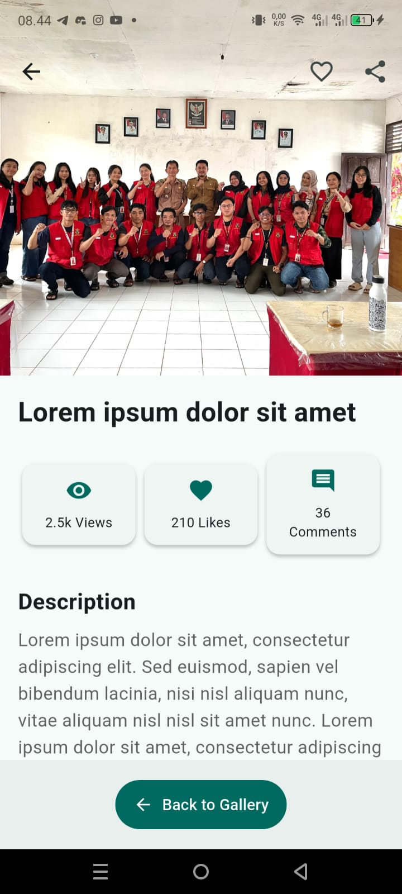

# Flutter Simple Gallery App


Aplikasi **Gallery Sederhana** berbasis Flutter. 
Project ini dibuat untuk menyelesaikan tugas Dicoding **Belajar Membuat Aplikasi Flutter untuk Pemula** dan memanfaatkan konsep dasar **multi-screen**, **navigasi**, **state management sederhana**, serta penggunaan berbagai **widget UI** di Flutter.

## Fitur Aplikasi
- **Halaman Login**
  - Form login dengan validasi email & password (Bebas memasukkan user dan password)
  - Tombol login sosial (sebagai tampilan UI)

- **Halaman Utama (Home)**
  - Banner *Featured Collection*
  - Grid preview item galeri
  - Navigasi bawah: **Home**, **Favorites**, **Gallery**

- **Halaman Favorites**
  - Tandai/hapus tanda favorit pada item galeri
  - Filter tampilan hanya item favorit

- **Halaman Gallery**
  - Tampilan semua item galeri
  - Toggle tampilan **Grid/List**
  - Filter chips: **All / Favorites**
  - Pesan kosong (*empty state*) jika belum ada data

- **Halaman Detail**
  - Preview gambar penuh sebagai Hero
  - Tombol favorit & tombol share
  - Informasi tambahan: Views, Likes, Comments
  - Daftar item terkait (*Related Items*)

## Tampilan Aplikasi 
| Login | Home | Favorites |
|-------|------|-----------|
|  |  |  |

| Gallery (All) | Gallery (Favorites) | Detail |
|---------------|---------------------|--------|
|  |  |  |

## Konsep Flutter yang Diimplementasikan

- **Stateless & Stateful Widgets**: Penggunaan widget yang sesuai untuk UI dan manajemen state
- **Navigation**: Implementasi navigasi antar halaman dengan named routes
- **Layout Building**: Penggunaan berbagai widget layout seperti Column, Row, GridView, dan ListView
- **Media Assets**: Penggunaan gambar lokal yang diatur melalui pubspec.yaml
- **User Input**: Form dan validasi input pada login screen
- **State Management**: Pengelolaan state sederhana untuk fitur favorit

## Struktur Project

```
lib/
   main.dart                 # Entry point aplikasi
   models/
      gallery_item.dart     # Model data untuk gallery item
   screens/
      login_screen.dart     # Halaman login
      home_screen.dart      # Halaman utama
      gallery_screen.dart   # Halaman gallery
      detail_screen.dart    # Halaman detail item
   widgets/
       custom_text_field.dart # Widget input teks kustom
       gallery_item_card.dart # Widget card untuk item gallery
```

## Cara Menjalankan Aplikasi

1. Pastikan Flutter SDK sudah terinstall di sistem Anda
2. Clone repository ini
3. Jalankan `flutter pub get` untuk menginstall dependencies
4. Jalankan `flutter run` untuk memulai aplikasi

## Tentang Pengembang

Project ini dibuat sebagai tugas untuk kursus Dicoding **Belajar Membuat Aplikasi Flutter untuk Pemula**.
